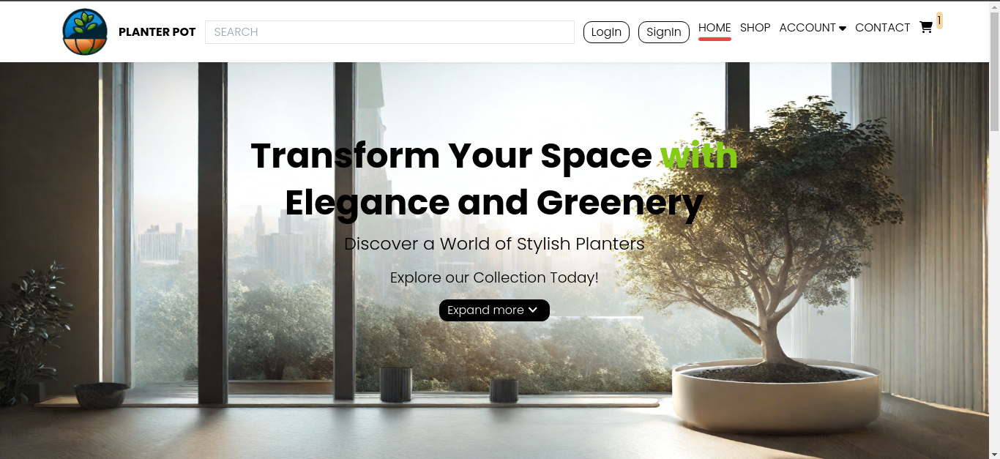
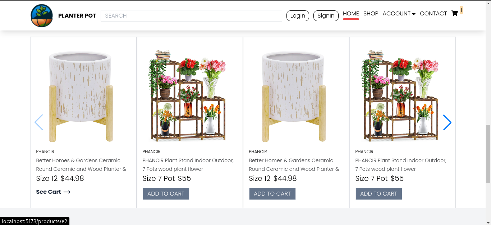
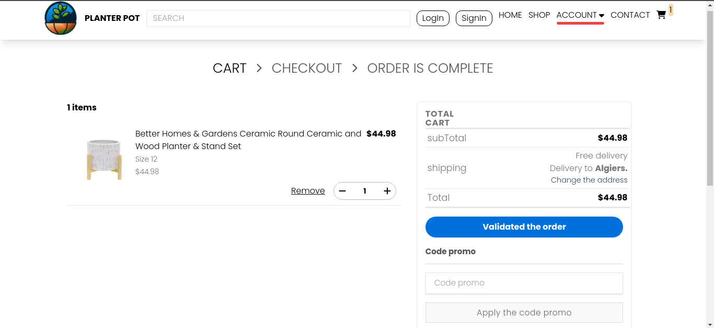
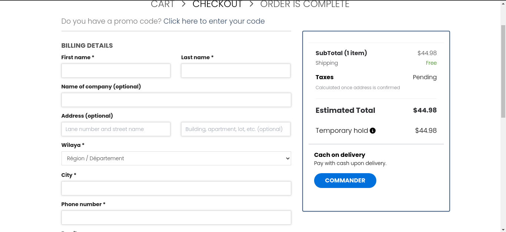
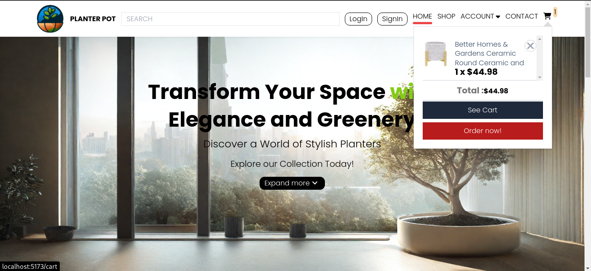

# Planter pots

is a e-commerce website for planter pots with
-carosiul section for product
-cart and command section
-link with mongodb and google sheet api
-it's a spa project build with reactrouter and redux with tailwindcss
-non responsive for mobile and is just for desktops
-> you can watch add orders in this spreadsheets [google_sheet](https://docs.google.com/spreadsheets/d/1iDD35caRGiRh6WHyMn66XxC3_VFTvB9EMKUl-K-LMtE/edit#gid=0)

-I designed the site just build any idea in my mind
-some pages i haven't add like shop and make the website responsive for mobile and add a dark mode
-i use V0 for page featured and for the footer
-next project , the first think i will focus on is the design
here some images for the website
[]

->[live_demo]()

# React + Vite

This template provides a minimal setup to get React working in Vite with HMR and some ESLint rules.

Currently, two official plugins are available:

- [@vitejs/plugin-react](https://github.com/vitejs/vite-plugin-react/blob/main/packages/plugin-react/README.md) uses [Babel](https://babeljs.io/) for Fast Refresh
- [@vitejs/plugin-react-swc](https://github.com/vitejs/vite-plugin-react-swc) uses [SWC](https://swc.rs/) for Fast Refresh
